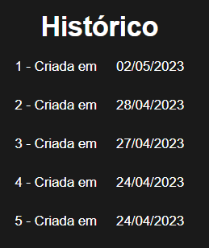
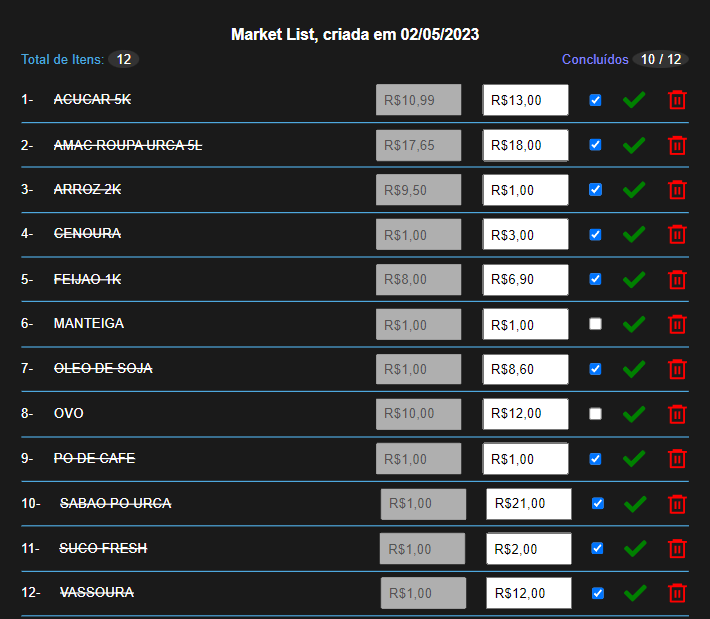

  

# MARKET LIST

Projeto criado do zero a partir da minha nescessiade de fazer minhas lista de compras mensais e saber quanto paguei no mesmo produto no mês anterior.
Nesse app vc pode cadastrar os produtos numa lista global e criar sua lista particular do mês sendo, a partir da segunda lista inserindo algum item que compunha numa lista anterior, traz o ultimo valor inserido do produto.
Historico das lista é ordenado pela data de criação, e a lista de compra por ordem alfabetica para facilitar encontrar os produtos podendo da um check no qual ja esta no carrinho de compras fisico e atualizar o valor pago naquele mês.

Projeto foi desenvolvido utilizando primeiramento o JsonServer e depois convertido para o Firebase para ser utilizado onLine.

## Screenshots

  

  

## Funcionalidades

- Logar pela conta Google, gerando sua lista particular pra cada conta.
- Cadastrar produtos novos.
- Criar nova lista.
- Inserir, deletar, atualizar preço e marcar como ja colocado no carrinho cada produto.
- Conectado ao Firebase para poder usar on-line, já com desing Mobile.

## 🛠 Habilidades

React/Vite, Style Components, Axios, JsonServer, Firebase, Javascript, HTML, CSS...

## Intalação

### Abra um terminal e copie este repositório com o comando

clone o repositório, um projeto no Firebase, use o .env.exemplo crie o arquivo .env.local e coloque as variáveis de ambiente e depois e so rodar
git clone https://github.com/3ddybr/market_shopping_list.git

### ou use a opção de download.

### Entre na pasta web com

cd market_shopping_list

### Instale as dependências

yarn install

### Rode a aplicação

yarn dev
